# create-group Lambda Function

This allows us to add a group item to DynamoDB

## Install and Package
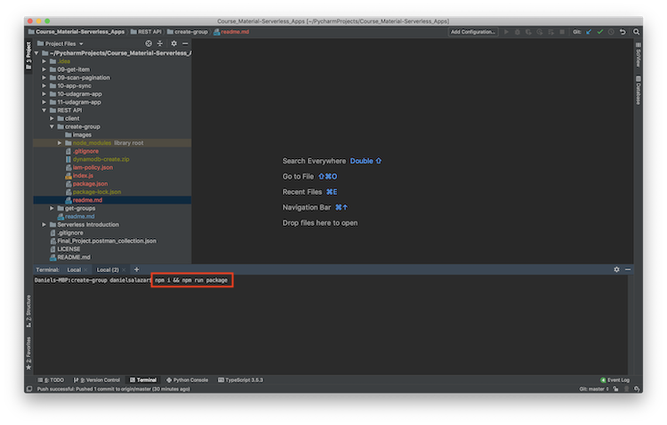

Execute the command to install and package the folder

## Create Lambda Function
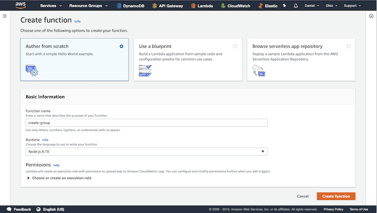

Create a new Lambda function, give it a name, and configure the 
runtime. Then click Create Function.

## Upload Function
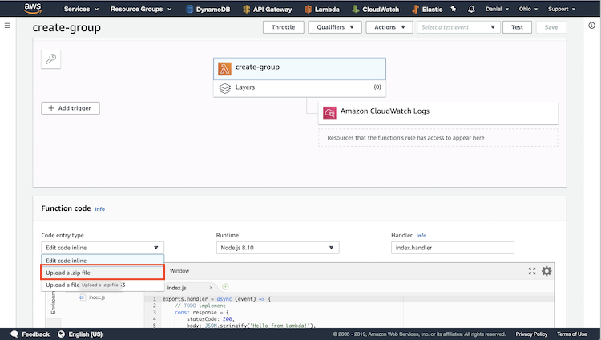

Change the code entry type to Upload a .zip file.

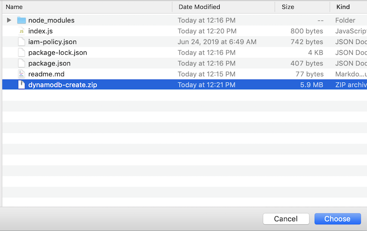

Click upload and select the .zip file that was just created.

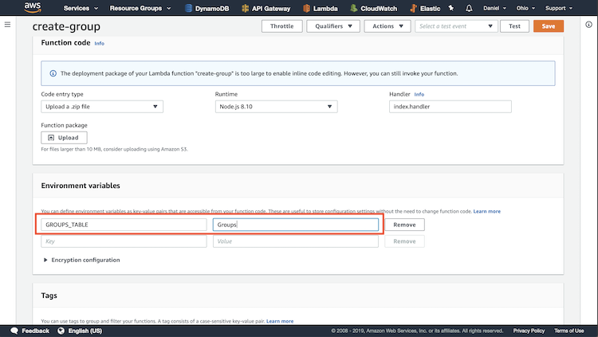

Update the Environment Variables to include the GROUPS_TABLE item
as a reference to the name of the Table. In my case I named the table
Groups.

## Update IAM Policy
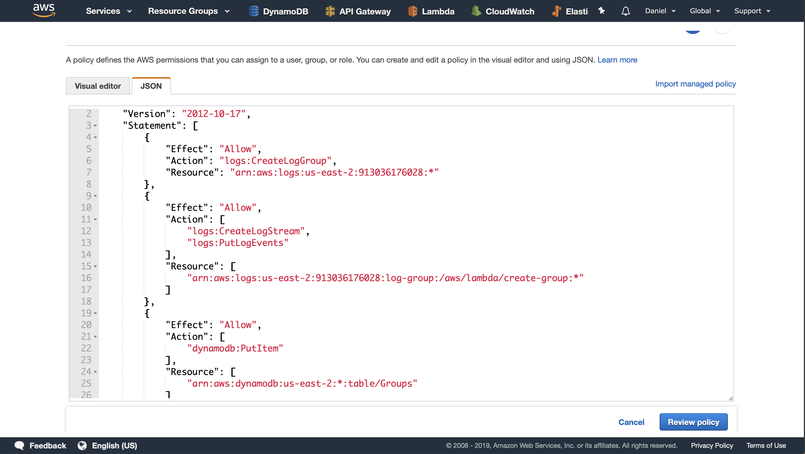

As explained in previous examples, in order to interact with
DynamoDB, the IAM policy must be updated. Edit the Policy and
copy-paste the src policy into the code window.

## Create New Endpoint
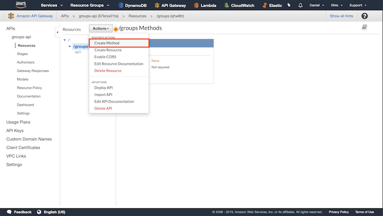

Head on over to APIGateway, select the groups-api resource, and select
the groups endpoint. To create a new access point, click Action and click
Create Method.

## Update Accesspoint Type
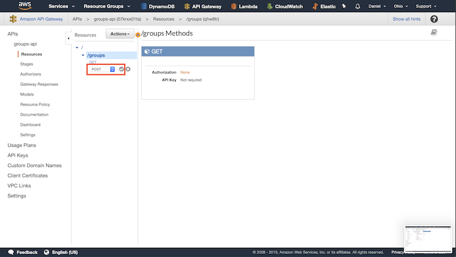

In the dropdown menu, select POST. Click the check mark button.

## Update Setup
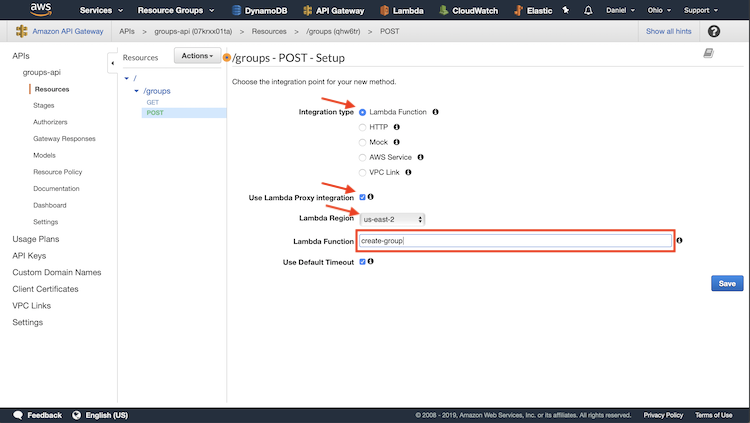

Select Lambda Function, check the Proxy Integration box, specify the
region of the Lambda Function, and enter in the name of the
Lambda function. In my case I named it create-group. Then click Save.

## Deploy API
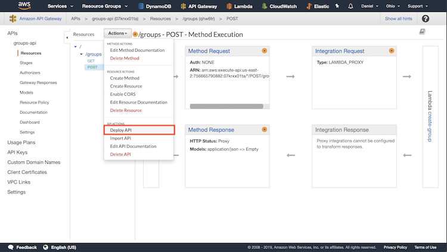

In order to save the changes, we need to redeploy the API. Click
Action and click Deploy API. 

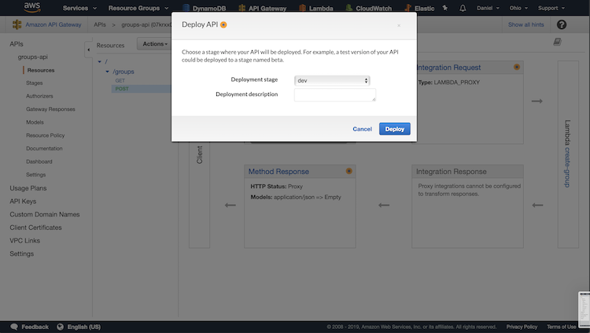

Then, specify which stage you want to deploy this API to. Since
we are redeploying the API, choose dev.

## Enable CORS
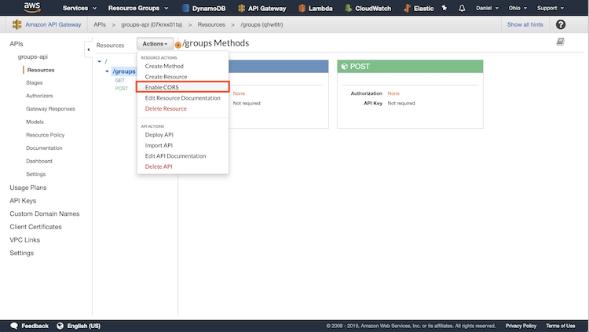

Head back over to APIGateway. Select the /groups endpoint. Click
Action. Click Enable CORS.

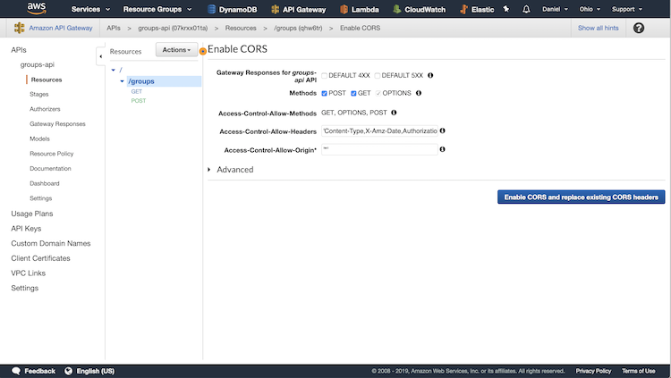

Keep the default settings and click Enable CORS.

## Deploy API
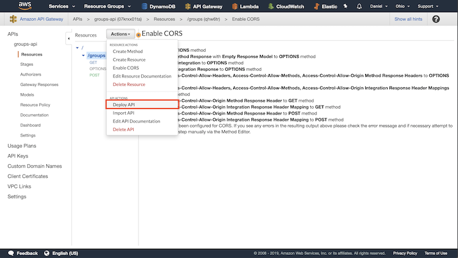

In order to save the changes, we need to redeploy the API. Click
Action and click Deploy API. 

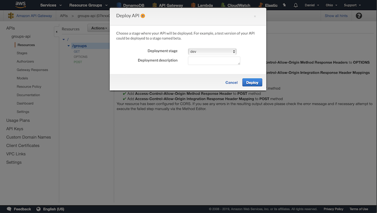

Then, specify which stage you want to deploy this API to. Since
we are redeploying the API, choose dev.

That's it! Now you can add new items to your DynamoDB using a Lambda
function.
