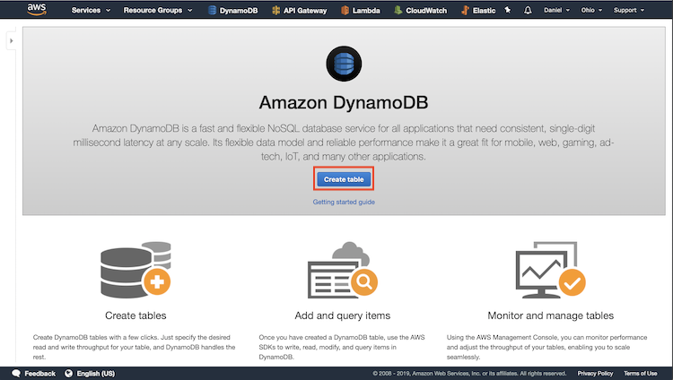
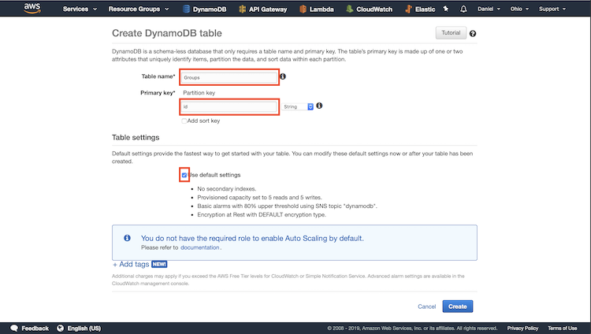
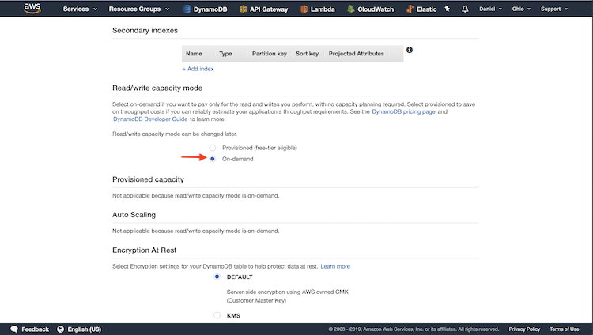
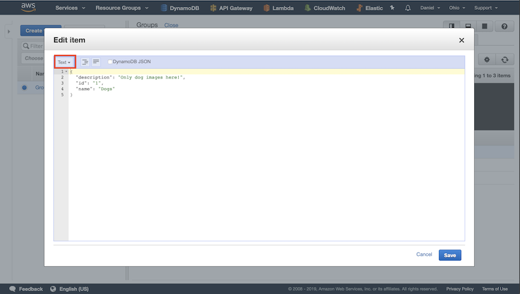
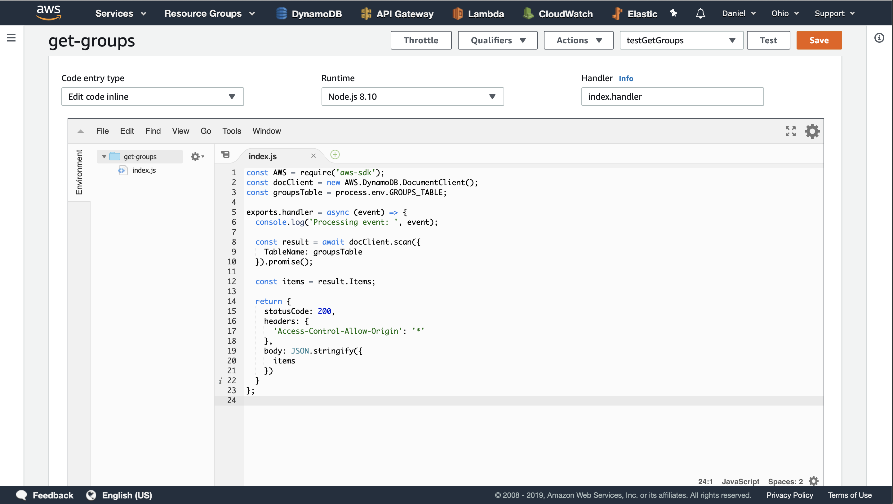
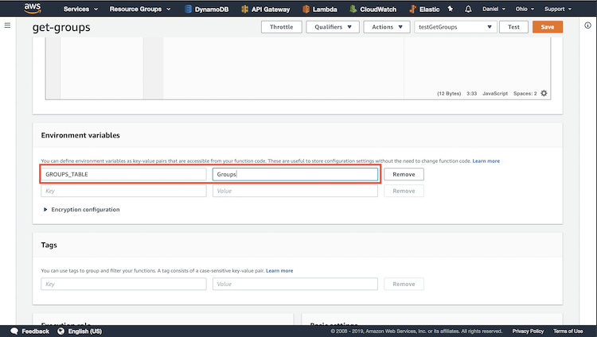
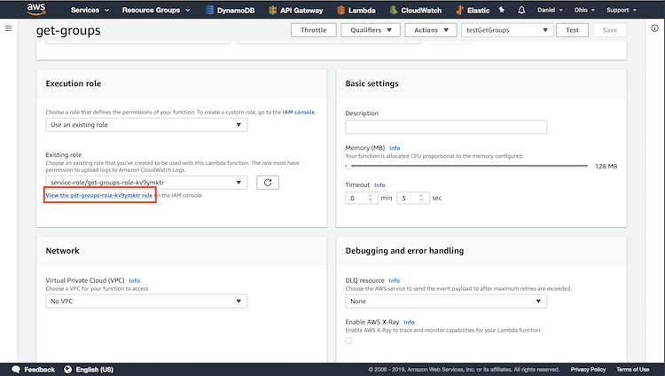
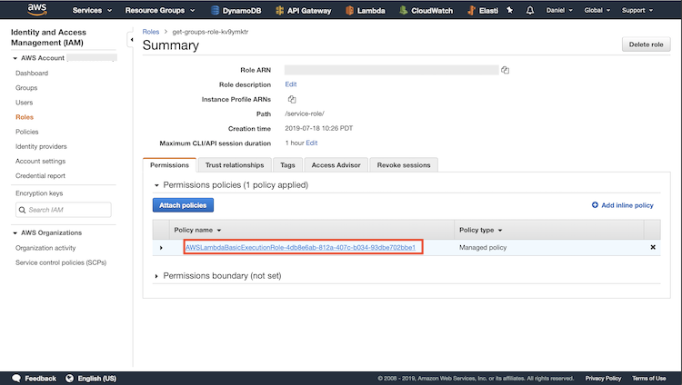
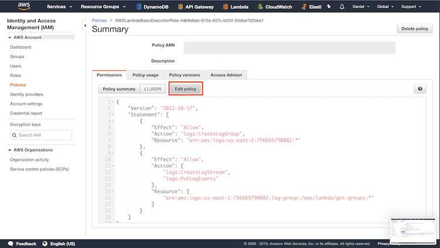
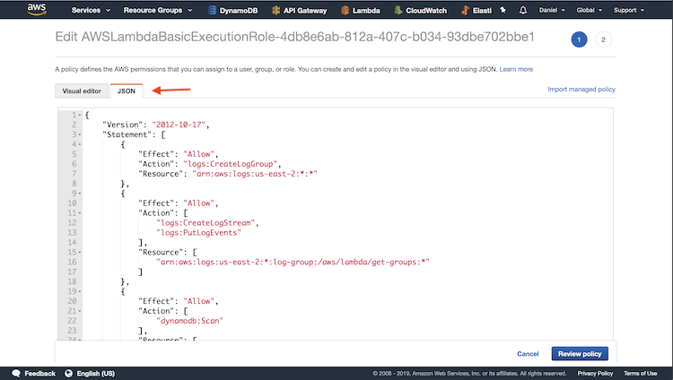

# DynamoDB get-groups Lambda Function

Retrieve the groups Table from DynamoDB using a Lambda function.

## Create Database

Go to DynamoDB and create a database

## Setup Database

Give it a name, specify the key is named id of type string,
and uncheck the default settings checkbox.

Click the radio button On-Demand and click create.

## Add Items

To add items to the database, select the Items tab, then click add
item. Change the drop down menu from tree to text. Copy and paste
the three mock items from the previous function and save them.

## Update Lambda Function 

Go back to Lambda and copy-paste the source code into the code
window. Click save. 

## Update Environment Variables

The source code uses one variable called GROUPS_TABLE, which is
a reference to the name of the DynamoDB Table name. In my case,
the table I created was called Groups.

## Update Functions Execution Role

In order for the Lambda function to access DynamoDB, we need to
connect it. To do this click on the link under Execution Role.
 

Click on the Policy link

Click on Edit Policy

Click on JSON and copy-paste the IAM policy role into the code
window. Then click Review Policy and save the Policy.

That's it! Now you can get all the items using Postman.
