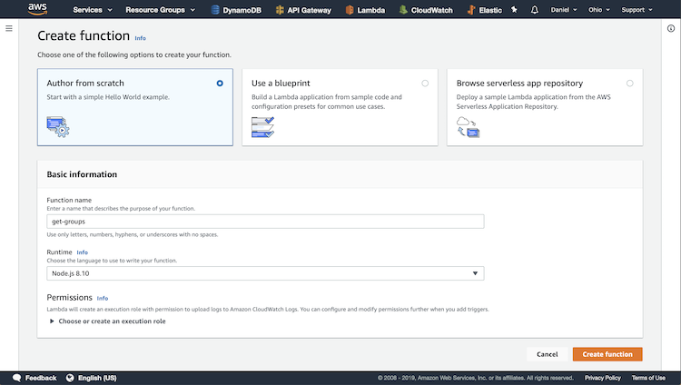
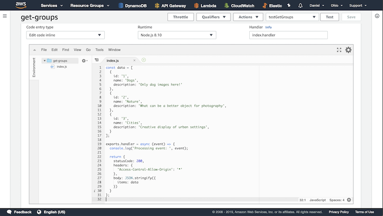
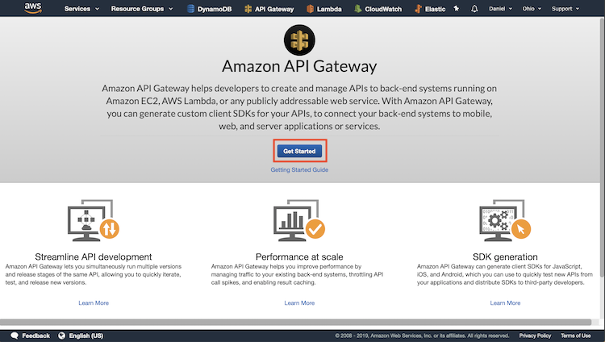
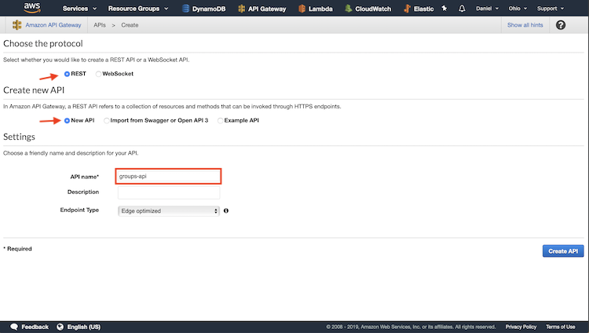
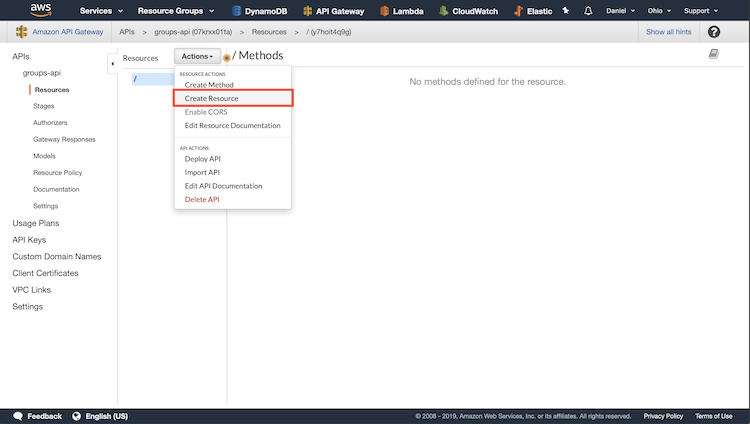
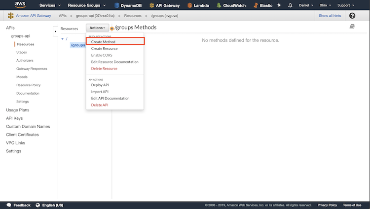
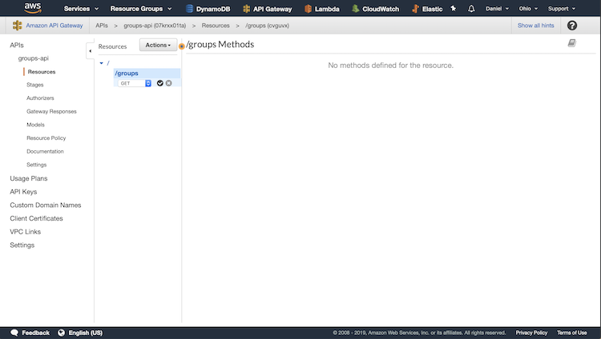
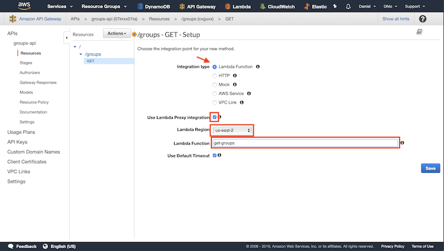
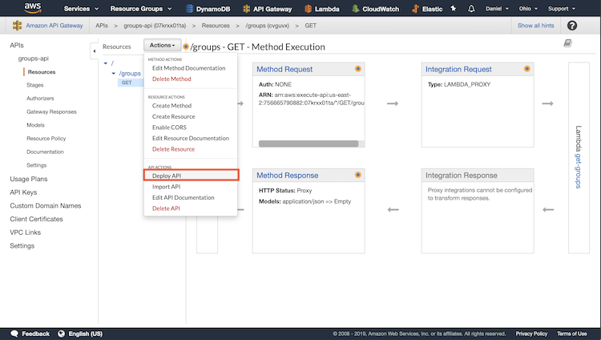
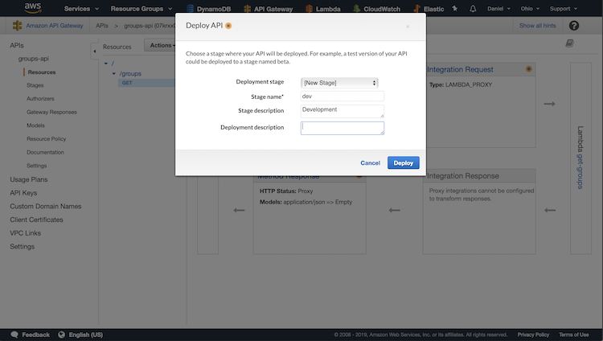

# Lambda Function get-groups

This sets up a base Lambda function and provides test data.

## Create Function

Create a new function, give it a name, and configure the runtime.

## Add Code

Copy and paste the source code into the Lambda function code window.

## Create APIGateway Source

Go to AWS APIGateway and create a new API.

## Configure API

Choose REST, choose New API, give it a name, and click Create API.

## Create Resource

In order to access the API, you need to configure endpoints. To do
this, click Actions, then click Create Resource. Give it a name and
create it.

## Create Method

Now that we have an endpoint set up, we need to create access points.
To do this click Actions, then click Create Method.

## Configure Access Point Type

In the drop down menu select GET. Click the check mark button.

## Setup Access Point

In order to add functionality, we need to connect it to a Lambda
function. To do this, select Lambda Function, check the box for
Proxy Integration, select the region that your Lambda Function
is in, enter the name of your Lambda function, and click save.

## Deploy API

We need to deploy the API to save the changes. To do this, click
Action, then click Deploy API.

## Setup API Deployment

Select New Stage, give it a name, and optionally give it a description.
Clicking deploy will save your API.

That's it! Now your API GET request can be accessed using either
Postman or the React client.

