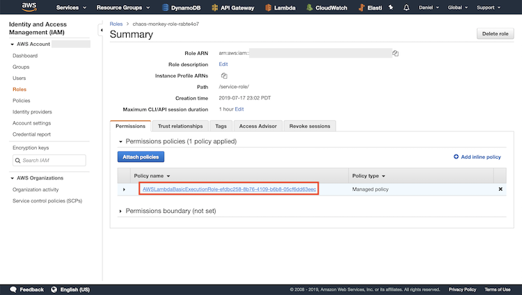
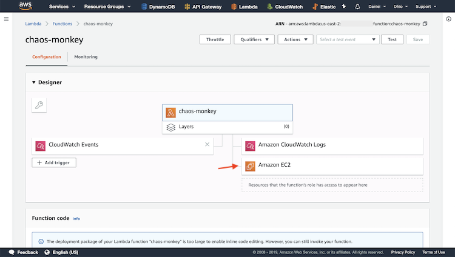

# Chaos Monkey

This Lambda function will react to events from AWS platform
 with the use of ChaosMonkey

This function will test the robustness of our distributed system
and ensures stability. It will terminate a random host.

We will use CloudWatch to send an event every 5 minutes to the
Lambda function as input. 

On each event, the Lambda function will get a list of instances
from the placements and randomly terminate one of the instances.

## Package Files

Install the dependencies and zip the contents.

## Create Function

Give it a name and runtime. Click "Create Function".

## Change Entry Type

Change the code entry type to "Upload a .zip file".

## Upload Zip

Choose the .zip file that was just created using npm run packages
and save the function.

## Create EC2 Instances

We can create two EC2 instances for chaos monkey to operate on.

## Create New CloudWatch Schedule Event

Head to CloudWatch and click "Events".

Click "Get Started".

Click "schedule", change the number to what ever interval you would like. I chose 1 for
immediate results. Popint it to the Lambda function that was just created. and click
"Configure details".

Give the rule a name and click "Create rule".

Switch to Monitoring mode to see that there was an error. Click "View logs..."

If you click on the message that contains errorMesage, you can view what the problem is.
Th Lambda function is not allowed to access the EC2 instances. Time to change that.

Go back to Lambda and switch back from Monitoring to Configuration. Scroll down to 
Execution Roll. Click the link.

Click the link again.

Edit the policy

Copy the IAM policy from this folder and paste into the code window. Click "Review Policy".

Now the Lambda function should shut down random EC2 servers!

