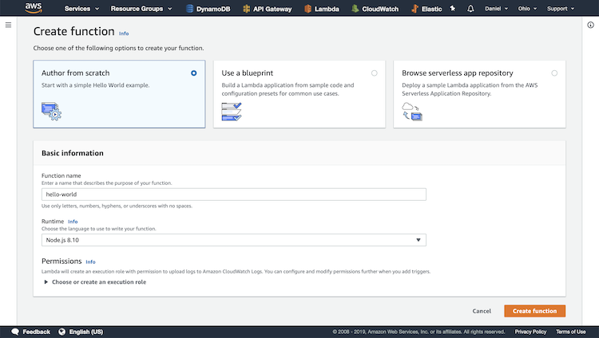
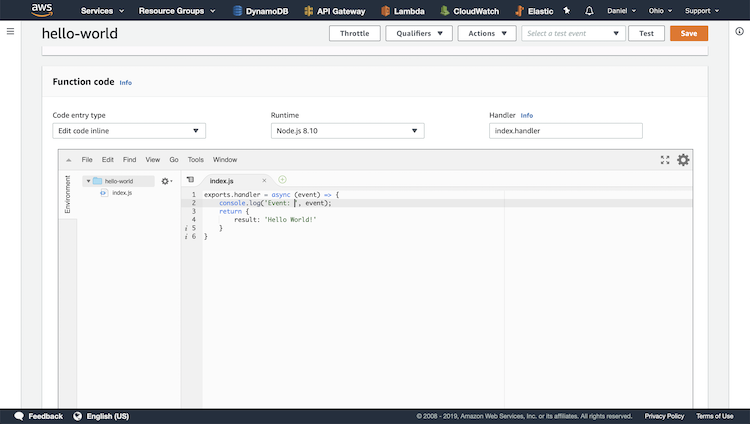
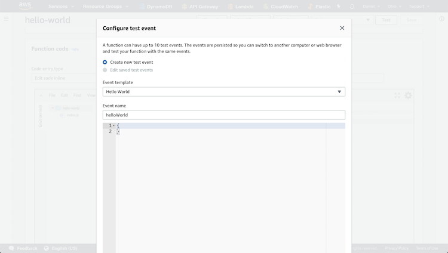
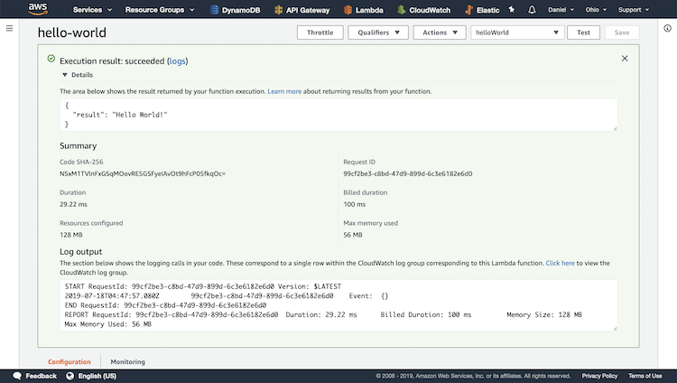

# Hello World Serverless

This is the beginner project that teaches us about creating Lambda functions.
We learn about the fact that all Lambda functions are able to write to CloudWatch logs
by default.

AWS Lambda takes care of a lot of things for us:
* Deploying code to a host machine
* autoscale
* reliability

## Create Function

We give the new function a name and configure the runtime.

## Update Function's Code

We write to the console and return a JSON payload with the string "Hello World!".

## Test Function

We are able to create events to test our Lambda function. In this case we use a
blank body since all we are doing is returning a static string.

## View Test Results 

As we can see, the Lambda function returns result: "Hello World!". We are also 
able to view the duration, memory, and the logs.
