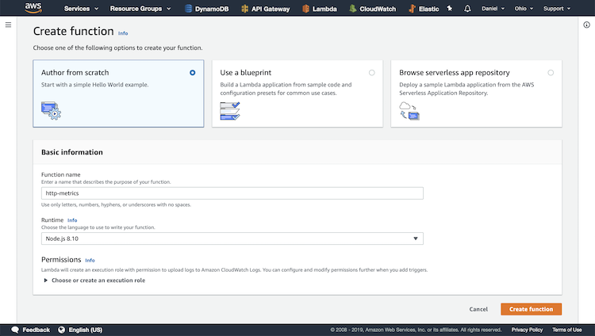
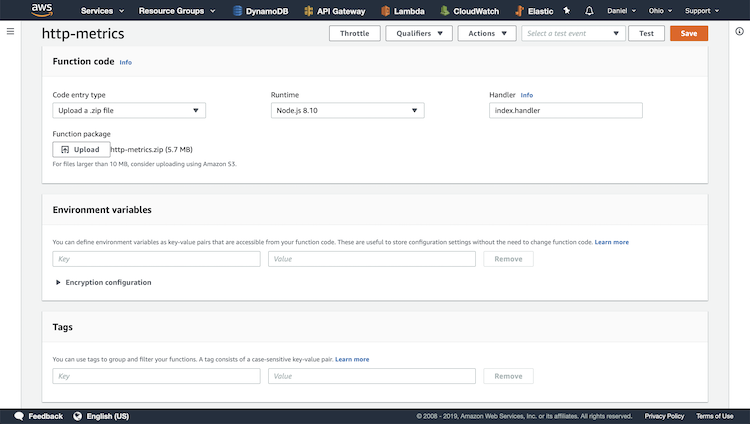
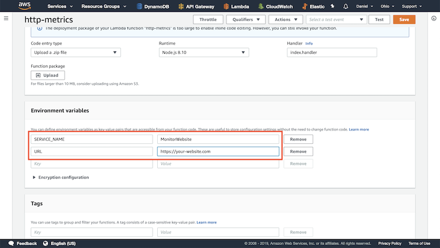
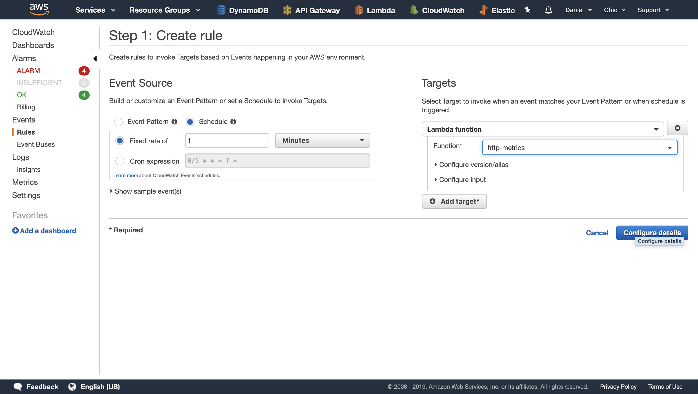
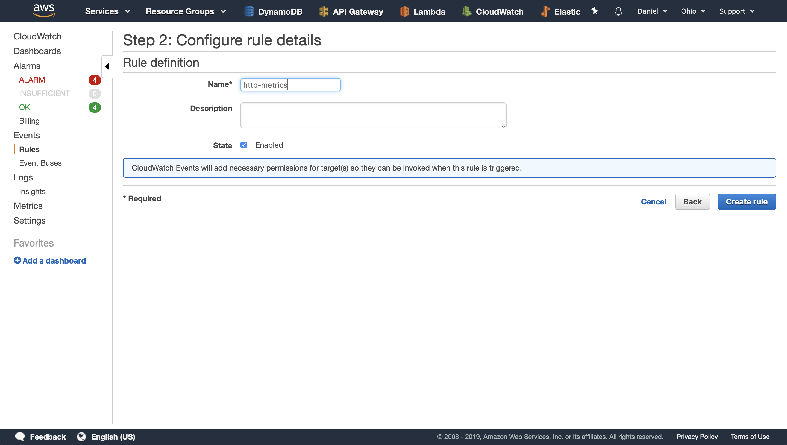
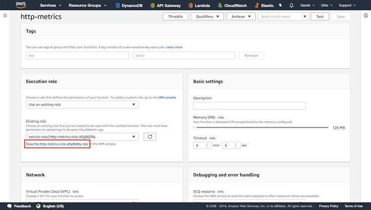
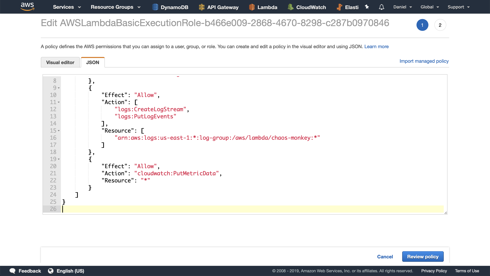

# Lambda Function: http-metrics

## Create Fucntion

Create a new function, give it a name, and configure the runtime.
Click "Create Function"

## Upload Zip

Upload the zip file and save the function.

## Add Environment Variables

The function requires both SERVICE_NAME and URL

## Add CloudWatch Event Input

Create a new event and associate it to the http-metrics Lambda function

## Name New Rule

Give it a name and save it

## Connect Function to CloudWatch

We need to be able to put data into CloudWatch, so lets configure the access

## Edit Role

Copy and paste the IAM policy and save.

