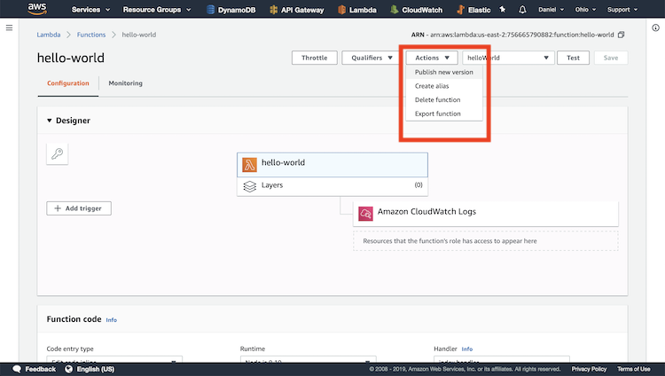
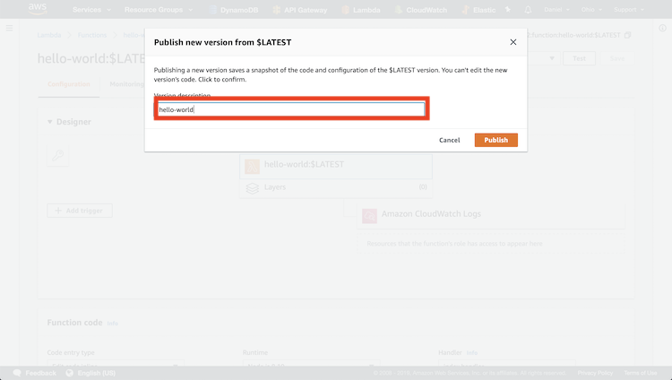
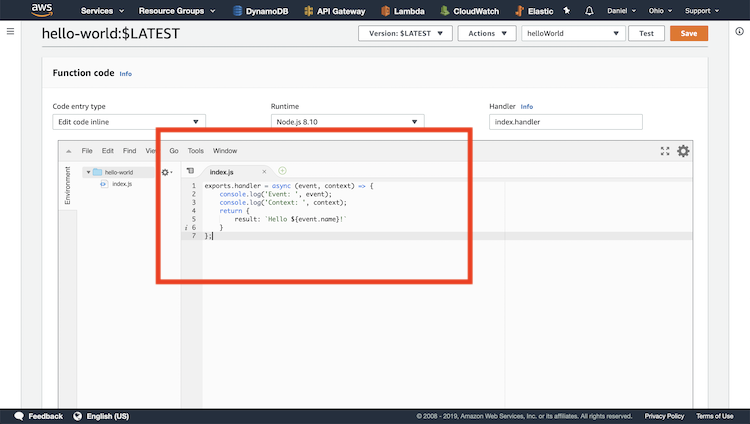
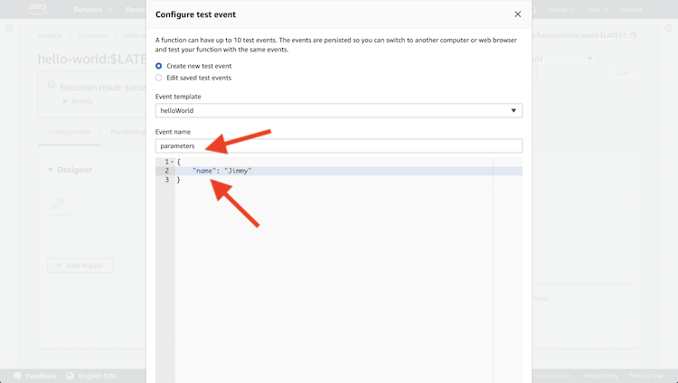
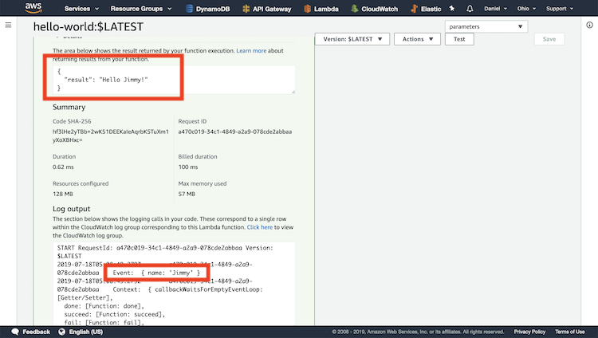

# Parameters

## Publish Function

We need to publish the hello-world function to save it.

## Add Function Name

Wee need to give the published function a name. Click publish.

## Update New Function

Now we can add in the source code for a new function. Save function.

# Add New Test

We can configure a new test. 
* Give it a new name 
* Add a name field to the body

Create the test.

This means that we are going to be passing in a name using the event.

# Test Function

By clicking test, we are provided with some results. 
* As you can see in the first box, The Lambda function returned the string 
"Hello Jimmy!". This was based on the input we passed to it. 
* As you can see in the second box, the object passed in contained the name
Jimmy.

